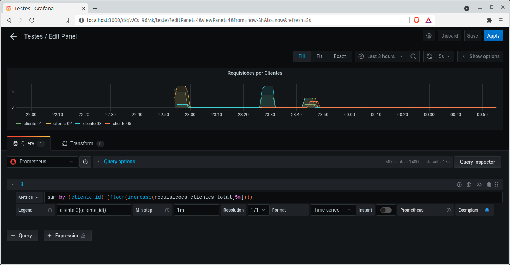

# POC
Essa POC mostra a instrumentação de uma API
Java com Spring usando Prometheus para uma métrica
de negócio hipotética.



As instruções para demonstração da POC estão à seguir.

## API
Abrir o projeto em sua IDE de preferência e inicie sua execução.

Dois caminhos são importantes.

Métricas do Prometheus:
`http://localhost:8080/actuator/prometheus`

Consulta (GET) que incrementa o contador hipotético:
`http://localhost:8080/xptos/{codigo}` onde
`{codigo}` deve ser um numéro inteiro. 


## Prometheus

Criar uma imagem personalizada do Prometheus com o Dockerfile
em `containers/prometheus` e criar um container:
```
$ docker build -t prometheus-custom . 
$ docker run --name prometheus-custom -p 9090:9090 prometheus-custom
```

Acesse `http://localhost:9090` para testar.


## Grafana

### Passo 1
Subir o container.
```
$ docker run -d -p 3000:3000 grafana/grafana 
```

### Passo 2

Criar um Datasource apontando para o Prometheus.

**IMPORTANTE!** usar o host especial para acesso entre containers sem link no docker:

`172.17.0.1:9090` para linux e
`host.docker.internal:9090` para Windows

### Passo 3

Criar um painel com o seguinte JSON:
```json
{
  "aliasColors": {},
  "dashLength": 10,
  "datasource": "Prometheus",
  "fieldConfig": {
    "defaults": {},
    "overrides": []
  },
  "fill": 1,
  "gridPos": {
    "h": 8,
    "w": 12,
    "x": 0,
    "y": 0
  },
  "id": 23763571993,
  "legend": {
    "avg": false,
    "current": false,
    "max": false,
    "min": false,
    "show": true,
    "total": false,
    "values": false
  },
  "lines": true,
  "linewidth": 1,
  "nullPointMode": "null",
  "options": {
    "alertThreshold": true
  },
  "pluginVersion": "7.5.7",
  "pointradius": 2,
  "renderer": "flot",
  "seriesOverrides": [],
  "spaceLength": 10,
  "targets": [
    {
      "expr": "sum by (cliente_id) (floor(increase(requisicoes_clientes_total[5m])))",
      "legendFormat": "cliente 0{{cliente_id}}",
      "interval": "1m",
      "exemplar": true,
      "refId": "B",
      "hide": false
    }
  ],
  "thresholds": [],
  "timeRegions": [],
  "title": "requisicoes por clientes",
  "tooltip": {
    "shared": true,
    "sort": 0,
    "value_type": "individual"
  },
  "type": "graph",
  "xaxis": {
    "buckets": null,
    "mode": "time",
    "name": null,
    "show": true,
    "values": []
  },
  "yaxes": [
    {
      "format": "short",
      "label": null,
      "logBase": 1,
      "max": null,
      "min": null,
      "show": true
    },
    {
      "format": "short",
      "label": null,
      "logBase": 1,
      "max": null,
      "min": null,
      "show": true
    }
  ],
  "yaxis": {
    "align": false,
    "alignLevel": null
  },
  "description": "",
  "timeFrom": null,
  "timeShift": null,
  "bars": false,
  "dashes": false,
  "fillGradient": 0,
  "hiddenSeries": false,
  "percentage": false,
  "points": false,
  "stack": false,
  "steppedLine": false
}
```

### Passo 4
Have fun ;)